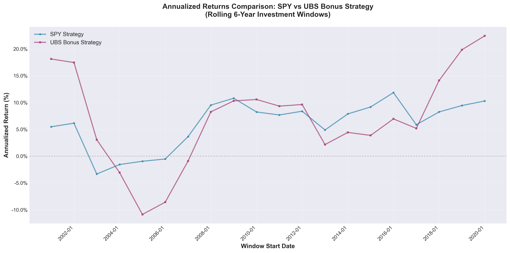
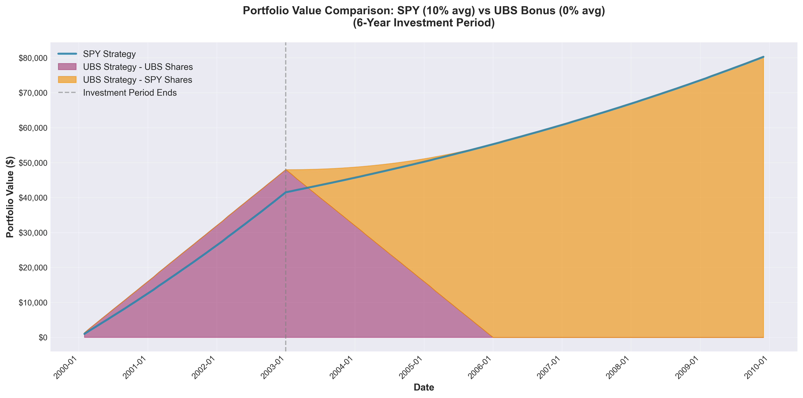

# UBS Stock Comparison Simulation

This project compares two investment strategies over rolling 6-year windows:

1. **SPY Strategy**: Invest $1,000/month in SPY (S&P 500 ETF) for the first 3 years, then let the portfolio grow for the remaining 3 years.

2. **UBS Bonus Strategy**: Invest $1,000/month in UBS stock for the first 3 years, receiving 1/3 bonus shares for free. After exactly 3 years, each purchase matures and all shares (regular + bonus) are sold, with proceeds invested in SPY for the remaining period.

## Scripts

### `simulate.py`
Simulates both strategies using historical market data from JSON files:
- `spy_monthly_30y.json`: Historical SPY monthly prices
- `ubs_monthly_max.json`: Historical UBS monthly prices

The script calculates annualized returns for rolling 6-year windows and generates a comparison chart showing which strategy performs better across different time periods.

### `simulate_returns.py`
Simulates both strategies using fixed average yearly returns instead of historical data. This allows for scenario analysis with different return assumptions. The script tracks portfolio values over time and visualizes:
- SPY Strategy: Single line showing total portfolio value
- UBS Bonus Strategy: Stacked area chart showing UBS shares (purple) and SPY shares (orange) separately

## Key Features

- **Rolling window analysis**: Compare strategies across multiple time periods
- **Bonus share tracking**: Accurately models UBS bonus shares that mature exactly 3 years after purchase
- **Portfolio composition visualization**: See how the UBS strategy transitions from UBS to SPY holdings over time
- **Configurable parameters**: Adjust investment amounts, return rates, and time periods

## Charts

